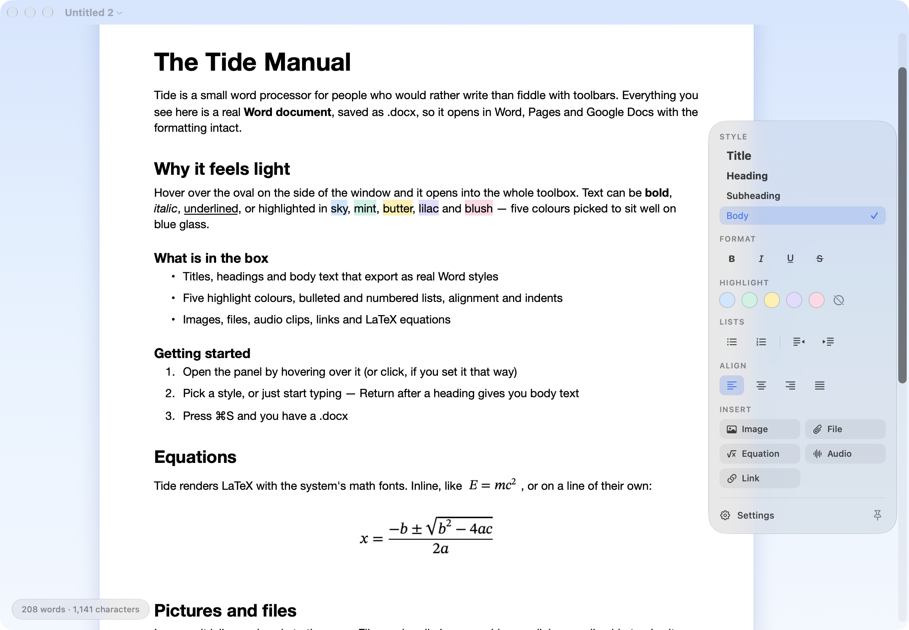
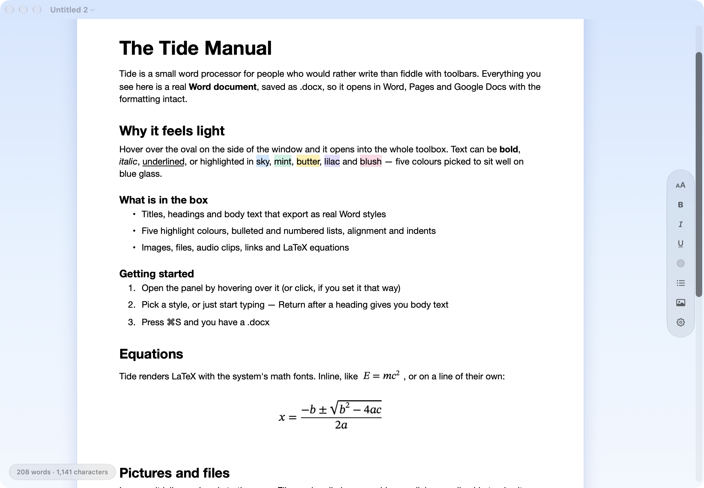
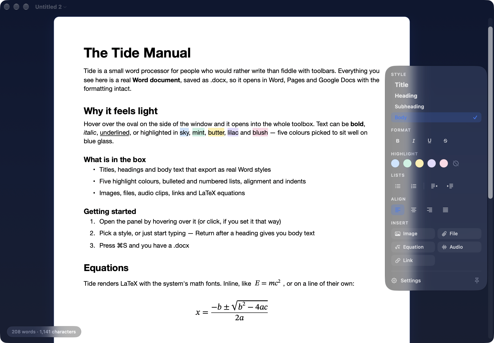
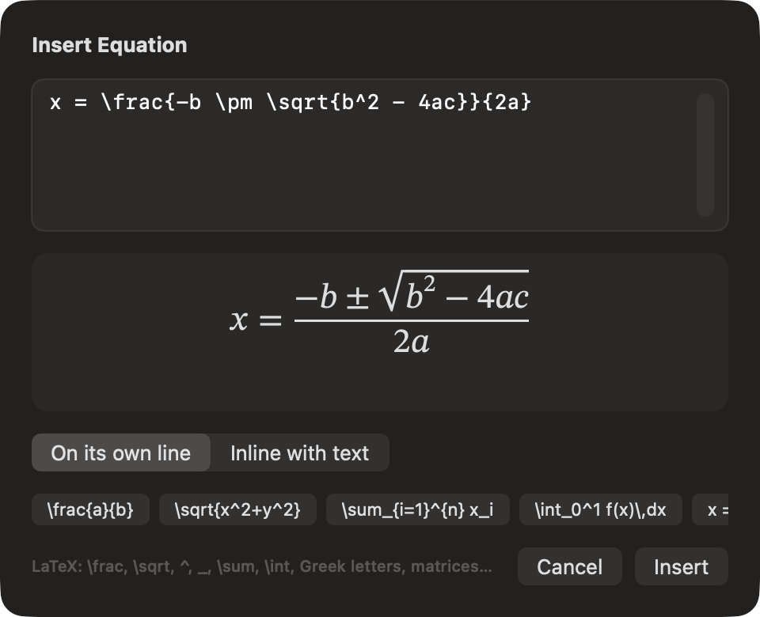
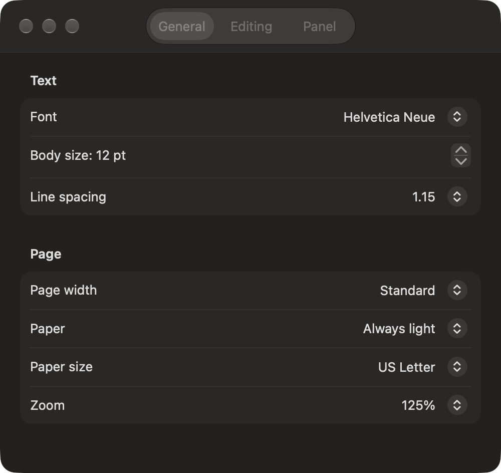

# Tide

A small, glassy word processor for macOS Tahoe. Think Essayist's calm page and floating
capsule, Word's file format, and nothing else in the way.



Every document is a real **.docx**. Tide writes Word files itself (Apple's built-in writer
drops highlights, pictures and links), so headings, highlights, lists, links, pictures and
equations survive the trip to Word, Pages and Google Docs — and back.

## The panel

The oval on the side of the window is the whole toolbox. Hover over it and it expands;
move away and it folds back into a pill of status icons. Pin it open with the pin at the
bottom, or switch it to click-to-open in Settings › Panel.

| collapsed | dark mode |
|---|---|
|  |  |

- **Style** — Title, Heading, Subheading, Body (exported as Word's Title / Heading 1 / Heading 2)
- **Format** — bold, italic, underline, strikethrough
- **Highlight** — five colours tuned for blue glass: Sky, Mint, Butter, Lilac, Blush
- **Lists** — bulleted, numbered, indent/outdent (Tab and Shift-Tab nest items; numbers renumber themselves)
- **Align** — left, centre, right, justify
- **Insert** — image, file, equation, audio, link
- **Settings** — also in the menu bar (`⌘,`)

## Equations

Insert › Equation takes LaTeX and renders it with the system's math fonts:
`\frac{a}{b}`, `\sqrt{x}`, `x^2`, `a_i`, `\sum_{i=1}^{n}`, `\int_0^1`, Greek letters,
`\left( … \right)`, `\begin{pmatrix} … \end{pmatrix}`, `\begin{cases} … \end{cases}` and the
usual operators. Equations can sit inline or on their own line; double-click one to edit it.
In .docx they are pictures with the LaTeX kept in the alt text, so Tide can edit them again
after a round trip. In Markdown they become `$…$` / `$$…$$`.



## Files

| | Open | Save / Save As | Export |
|---|---|---|---|
| Word (.docx) | ✓ | ✓ (native) | ✓ |
| Rich Text (.rtf, .rtfd) | ✓ | ✓ | ✓ |
| Plain text (.txt) | ✓ | ✓ | ✓ |
| Markdown (.md) | ✓ | ✓ | ✓ |
| Web page (.html) | ✓ | ✓ | ✓ (self-contained, pictures inlined) |
| PDF | | | ✓ (also Print) |

**File › Import…** inserts another document at the cursor. Markdown understands
Obsidian-style `==highlight==`, `$math$` and YAML front matter.

Audio and other files appear as chips (click an audio chip to play it, a file chip to open
it). In .docx they become links to the original file; Tide turns them back into chips when
it opens the file again.

## Settings

Font family, body size, line spacing, page width, paper (always light or match appearance),
paper size (US Letter / A4), zoom, spelling and autocorrect, smart quotes, panel side and
expand behaviour, word count.



## Shortcuts

| | |
|---|---|
| `⌘B` `⌘I` `⌘U` | bold, italic, underline |
| `⌃1` – `⌃5` / `⌃0` | highlight Sky … Blush / none |
| `⌥⌘1` – `⌥⌘4` | Title, Heading, Subheading, Body |
| `⇧⌘7` / `⇧⌘9` | bulleted / numbered list |
| `⌘]` / `⌘[` | indent / outdent |
| `⌥⌘E` | equation |
| `⌘K` | link |
| `⌥⌘I` | image |
| `⇧⌘I` | import |
| `⌥⌘P` | show / hide the panel |
| `⌘>` `⌘<` `⌘0` | zoom |

## Build

```
./build.sh                 # -> build.nosync/Tide.app
./build.sh --install       # also copies to ~/Applications and registers it for .docx
./build.sh --test          # runs the self-test (formatting, lists, every file format)
./build.sh --shots         # regenerates the screenshots in docs/
```

No Xcode project: `swiftc` straight into an app bundle, ad-hoc signed, macOS 26 SDK.
Output lives in `build.nosync/` so iCloud never evicts it. The icon comes from
`swift tools/make-icon.swift`.

Hidden switches on the binary: `--selftest`, `--snapshot <dir>` (renders the sample
document off-screen and captures the UI), `--dump <file>` (prints how a document imports).

## How it is put together

- **AppKit document architecture** (`TideDocument`, `NSDocumentController`) for the menu bar,
  Open/Save/Save As/Duplicate/Rename/Revert, autosave and versions. The menu bar is built in code.
- **TextKit 1** `NSTextView` inside a page host that centres the paper. List markers are real
  text (`\t•\t`), the paragraph style carries the `NSTextList`; `EditorController` owns every
  formatting operation and the Return/Delete/Tab behaviour inside lists.
- **SwiftUI on top**: the document view, the Liquid Glass panel (`glassEffect` in a
  `GlassEffectContainer`), the equation and link sheets, Settings and Help.
- **Own .docx reader and writer** (`DocxWriter`, `DocxReader`, `Zip`): document, styles,
  numbering, media, hyperlinks, core properties. Reading tolerates Word-authored files
  (tables flatten to paragraphs; headers, footers, footnotes and comments are skipped).
- **Equations**: a LaTeX subset → MathML, rendered by an off-screen `WKWebView` at 2x and
  turned into an alpha mask that the text view tints with the text colour, so equations
  follow dark paper.
- **Attachments**: `ImageCell`, `EquationCell` and `FileChipCell` draw pictures, equations and
  chips. AppKit swaps audio/video attachments over to its own media view and discards custom
  cells, so chips use a `ChipAttachment` subclass that keeps its cell.

## Known limits

- .docx round trip covers what Tide can make; Word features Tide does not model (tables,
  headers/footers, footnotes, comments, tracked changes, text boxes) are flattened or dropped.
- Equations are pictures in .docx (with the LaTeX in alt text), not Word's native equations.
- Audio and file chips export as links, not embedded objects.
